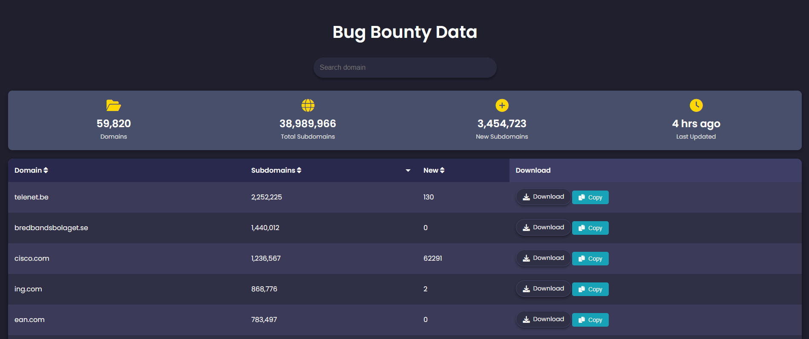

## BugBountyData

**List of Public Bug Bounty and Responsible Disclosure Programs:**

For a user-friendly experience, you can explore these programs via the website: [bugbountydata.netlify.app](https://bugbountydata.netlify.app). It provides an intuitive GUI for easier navigation and access to the latest bug bounty programs.

 


**📋 Guidelines:**
---

- **Important Note:** The list of subdomains provided is unfiltered. It may include both legitimate subdomains and domains with similar names (e.g., `dell.com`, `prm.dell.com`, `lynnebardell.com`, `cpanel.chrisdell.com`).

- **Wildcard Subdomains Policy:**  
  - If your organization allows all domains, no action is required on your part.
  - If your organization restricts to wildcard subdomains (e.g., `*.dell.com`), you can filter the results by using the following `grep` command to extract only the allowed subdomains:
  
    ```bash
    grep -aE "^(.*\.)?dell\.com$"
    ```

```yaml
curl -s "https://raw.githubusercontent.com/rix4uni/BugBountyData/refs/heads/main/data/dell.com.txt" | grep -aE "^(.*\.)?dell\.com$"
```
